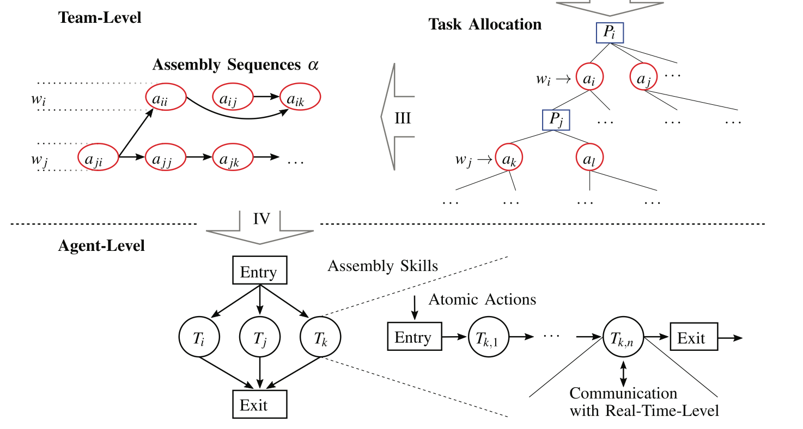

# Overview
The task planning is split into two main layers of abstraction.

### Higher Layer
 * Multiagent Human-Robot team approach. 
 * Skill sequences for every agent are produced. 
 * To treat humans and robots as agents of the same form -> move relevant differences into distinct cost functions.

### Lower Layer
 * Handle concrete skill execution.
 * Skills are composed of complex hierarchical and concurrent hybrid state machines.
 * State-Machine design allows to cope with unpredictable events

# Introduction
### Description
 * Robots work poorly in underdetermined/underspecified environments. 
 * Combine cognitive skills of Humans with the skills of collaborative Robots.
 * pHRI (physical Human-Robot Interaction) gained significant practical relevance recently. Robots work alongside Humans.
 * Consequently, the robot needs to be able to plan complex tasks, which involve interactions, collaboration, as Humans bring some indeterminism into the process.
  
### Problem
* Up to now, Humans and Robots work in isolated environments where each group performs its peculiar task sequence without physical interaction.
* Automatic generation of entire **collaborative** assembly plans and the according allocation to the team members, potentially even under optimality considerations, has not yet been considered. 
  
### Proposed Solution
Framework for human-robot collaboration that comprises three different architectural levels: 
* **Team Level** - assembly task planner. 
* **Agent Level** - skill planning 
* **Skill Execution Level** - final decisional component above the robot real-time control stack.

#### Team Level
Performs the task allocation for the agents based on an abstract world model and with the help of suitable cost metrics. To model our types of assembly processes suitably we employ __*AND/OR GRAPHS*__ as they implicitly model parallelism. Produces task sequences for every agent via ***A∗ graph-search***, from which it derives task descriptions that are then passed down to the agent’s skill execution level.

#### Agent Level
The agents implement modular and parameterizable skills via hierarchical and concurrent state machines in order to map abstract task descriptions to the subsequent realtime level.

#### Skill Execution Level
The concrete motion and interaction controls are performed in combination with protective reflexes.

# Assembly Modelling

### Problem Model
 * In the following, a mechanical assembly is denoted by $M$. 
 * Representation by Graph $G$.
 * Parts $p$ represneted by nodes:  $p \in P, P \subset M$. Every part $p$ is unique.
 * Parts $p_{i}, p_{j}$ are connected by an edge $e_{ij}$ if a contact between those parts exists.
 * Subassembly $P_{s} \subset P$ defines a subset of all parts $P$ that themself form a connected graph. As parts are unique, so is the subassembly. Subassembly with only one part is considered ***atomic***.

### Assembly Process
 * **Assembly Plan** is needed, which describes the possibilities of how to assemble a workpiece out of available parts. Assumes that a given *part-graph* $G$ already exists.
 * **Assembly Process** - The process of executing the assembly plan.
 * **Task Allocation** -  Assign the available workers (agents) $w \in W$ to the *assembly actions*.
 * **Assembly Action $a$** - Denotes one step in the assembly process.
* **Assembly Sequence $α$** - Assembly actions that lead from the initial configuration to the finished product.

### Assumptions
* **Subassembly is stable <=>** $st(P_{s})$. Its parts remain in contact without applying any external forces and the relative geometry of all parts does not change.
* Actions $a$ are **mechanically and geometrically feasible**:
    1. $gf(a)$ - there exists a collision free path to join the two involved subassemblies.
    2. $mf(a)$ - holds if it is possible to permanently establish all necessary connections.
* Assembly plan is: ***Sequential, Monotonnic, Coherent***

### Assembly Plan Representation (AND/OR Graph)
* **Joining Subassemblies** might be a complex task to achieve thus *hard to automate*. **Assembly of Subassemblies** on the other hand might be somethin easy to achieve thus also *practical to automate*.
    * **Human** - joining the subassemblies.
    * **Robots** -  co-prepare the subassemblies.
  

* **Represent Assembly by AND/OR Graph** $Y_{M} = (V,E)$
    +  $M$ - mechanical assembly
    +  $V = {\{P_{s} | P_{s} ⊆ P ∧ st(P_{s})\}}$
    +  $E = {\{{P_{s,k}, P_{s,i} , P_{s,j}} | P_{s,k}, P_{s,i} , P_{s,j} ∈ V \}}$
    +  $P_{s,k} = (P_{s,i} ∪ P_{s,j} ) ∧ gf({P_{s,i}, P_{s,j} }) ∧ mf({P s,i , P s,j }).$

# Task Allocation and Planning
*Atomic actions are the most basic implementations at agent-level and communicate directly with the real-time-level. $w → a$ denotes a specific allocation of agent $w$ to action $a$.* 

### Team Level Planning
* Solves the problem of task allocation in the assembly process for a team of human and robotic workers.
* No explicit distinction between human and robotic workers, since the team-level planner relays only abstract task descriptions.
* Cost function makes it possible to distinguish between agents by encoding their respective capabilities.
    1. During the search, the **planner sends request** to perform a specific action to an agent.
    2. **Agent answers with the cost** and possibly a further request for an interaction, which in turn is integrated into the planning process. If an agent is not able to perform a specific action it returns **infinite costs**.
    3. Planner then uses the received costs from all available agents to **determine the optimal task allocation**.

### Agent Level Planning
* Maps the team-level planning process to a degree of abstraction just above the actual body (actuators and sensors) of the robot.
* Use the already mentioned hierarchical and concurrent state machines.
* Possible to use different robot types:
  * systems have to provide the necessary formal semantics to the team-level
* Handling of events such as collisions or human induced interruptions of the assembly process:
    * Deal with the consequences in a way that is consistent with the overall plan on team-level
    * Report a failure in plan execution 
    * Request replanning from the team-level planner. 

### Execution Level
Responsible for executing trajectory planning, controllers. Reflexes of the robot to unforeseen events are implemented as simple reactions to unexpected disturbances.

# Task Planning Implemented

### Team-Level
*Assembly plan in the form of an AND/OR graph is taken as input. Furthermore information about part locations, agents and other resources is provided.*
#### 1) Problem Statement
Find an allocation of agents to assembly actions that is optimal with respect to a specified cost function.
* Set of States: $S = {\{s_{1},  . . . , s_{n}\}}$
* Each state coreesponds to a set of OR-nodes : 
  $v_{o}(s) ⊆ V_{o}$
* Assembly actions apllicable in a given state - $a(s)$ corespond to a set of AND-nodes: $v_{a}(s) ⊆ V_a$

#### 2) Complexity Analysis

1. The **initial state** $s_0$ corresponds to the root node $v_{o,0}$ of $Y_M$ , which corresponds to the complete assembly $M$
2. Number of **possible sets of actions** in state $s$:   $n_{s,a} = \prod_{i}n_{a,i}$ where $n_{a,i}$ denotes the number of children of the i-th OR node.
3. Maximum number of assignments of agents in state $s$ is given by: 

$$N_{A} = \sum_{i=1}^{l}n_{s,a}\binom{n_{w}}{i}n_{s,o}!$$ 
$$l = min(n_{w}, n_{s,o})$$
4. The goal state $s_{g}$ contains only goal nodes that correspond to atomic subassemblies.
5. The **cost** of an action can be chosen from different possibilities.

#### 3) Multi-Agent considerations

##### a) Actions and Interactions:
 With a multi-agent scenario, actions are also used to enable interactions between two agents:
$$a(type, W)$$
   *  **Assembly actions**
$$ a_{1} := a(assemble, w_{a} )$$
   *  **Agent interactions** 
$$a_{2} := a(hand\_over, (w_{a} , w_{b} ))$$

 *  **Expanded AND/OR graph** - If an interaction is necessary, we insert a new OR node with  the corresponding subassembly $P` _{s}$ and a new AND node $v_{a}$ , which represents the interaction. ***The graph is expanding with the occurrence of interactions***.

##### b) Synchronization:
Agents **do not** need to synchronize their actions, as long as their action sequences $α$ are not connected via an interaction. Since the team-level planner knows (via confirmation from the agents) which actions have been performed, it can let agents wait until the requirements for their next scheduled task are fulfilled.

#### 4) Optimization Metric and Heuristic

* **Cost Aspects**:
    + **Execution Time:** We may distinguish between overall execution time and local execution time, i.e. the time needed for the execution of a single action.
    + **Resource costs:**: Resources such as energy consumption, peak power.
    + **Risk factors:** Danger to human, workload amplitude and frequency or ergonomic factors may be of relevance.
    + **Assumptions about the human worker:** A worker profile could be generated that maps to a cost function, using properties such as attention level, general experience level, and reliability.

* **Robot Cost**: $c_{r}(w,a) = k_{1}f_{t}(w, a) + k_{2}f_{p}(w, a)$,
  * $w$ - worker  
  * $a$ - action
  * $f_{t}$ - time needed by $w$ to perform $a$
  * $f_{p}$ - power consumption of $w$ when $a$ is performed

* **Human Cost**: $c_{h}(w,a) = k_{1}f_{a}(w, a) + k_{2}f_{w}(w, a)$,
  * $w$ - worker  
  * $a$ - action
  * $f_{a}$ - attention level of the human when performing action $a$
  * $f_{w}$ - workload measurement
* **Interaction Cost** - treat explicitly
* **A\* Heuristic:**   $H =  n_{a,min} * c_{a, min}$
  * $n_{a,min} = log_{2}(max(n_{p}(v_{o,i})))$ -  Minimum amount of assembly actions $n_{a,min}$ that need to be applied to get from the current state $s$ to the goal state $s_g$
    + $n_{p}$ yields the number of parts of the subassembly $P_{s}$ that corresponds to the OR node $v_{o,i}$.
  * $c_{a,min}$ - Minimum cost an agent can achieve for a given action

*  **Divide and Conquer** - Due to the large number of possible agent assignments to actions if many agents are used, or a complex assembly with many possibilities is to be built, it is often more efficient to reduce the problem complexity first. For this, we introduce **reducible subassemblies** - solve problem on a partial-graph first and recurr.

### Agent-Level
The assembly skills at agent level directly correspond to the actions received from the team-level planner.

  
  We call the skills defined by the highest layer of this state machine **compound skills**,, since they are *composed of more **basic ones***, which are also called **atomic action**.

#### Basic-Skills implemented:

* **Pick-Up Part:** This action assumes that the robot is already at the right location to perform the pick-up. It then adjusts its end-effector according to its available information about the specified part and grasps it.

* **Assemble Part:** This action assumes that the robot is at the right location to assemble the part. Furthermore, it implements the process of assembling the part.

* **Hand-Over:** To realize the hand-over of an object from one to another, several modalities are possible. In our case, we use so called haptic gestures...

* **Collision Handling:** This action corresponds to a collision reflex reaction based on the interpretation of sensed contact forces along the robot structure. In case of collisions the robot switches e.g. to manual guidance mode. The human may then safely store the robot at pre-defined locations until the human signals e.g. via haptic gestures that the robot may continue. Suitable algorithms for the detection of collisions can be found in [24]. We assume that the human brings the robot to the right state to reengage to the task.

